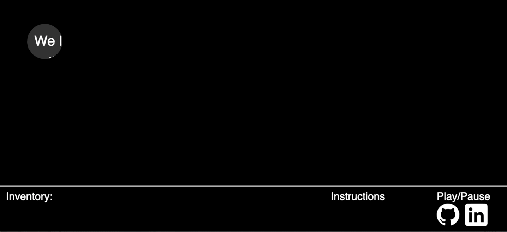

## Extracting Shadows

Live Demo: https://100lineslater.github.io/Extracting-Shadows/

## Overview

This app is meant to be an atmospheric experience for users to discover famous quotes. Users should ultimately be able to use their cursor as a spotlight to find words on the page and move words into the correct order. When all the words in the quote are in their correct order the quote will be displayed and the next level will be available.  

## Technologies

* HTML5 / Canvas
* Javascript
* CSS

## Features

The core feature of the game focuses on being able to recognize mouse clicks in specific areas of the canvas context and recognize when the all the targets have been found. To do this, I track the mouse position and keep track of coordinates and dimensions of the targets. 

I created rectangles around the goals to mask the words in the quotes and provide a target for the user to click on to input a word. The mask disappears on the next render when the right words is selected and it appears as if the user has placed the word in. A mask is also placed over the cursor with negative dimensions to create the appearance of the searchlight. 

When all the goals have been cleared, the level ends and the quote is revealed.

## Future Features

* Implement Obstacles or challenges